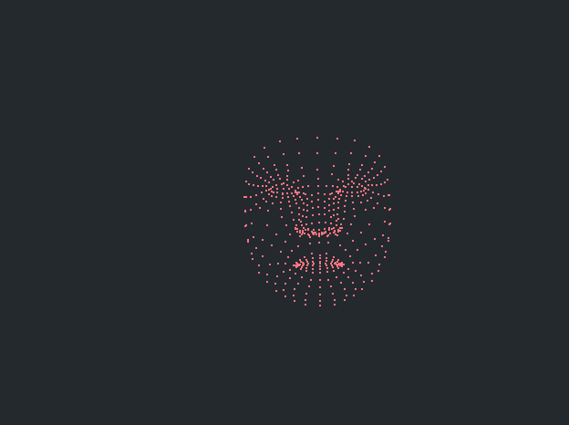

# lvvi

使用OpenGL可视化mediapipe的三维坐标

## 开源许可

- [GLEW](thirdparty/GLEW/LICENSE)

- [GLFW](thirdparty/GLFW/LICENSE)

- [spdlog](thirdparty/spdlog/LICENSE)

- [mediapipe](thirdparty/mediapipe/LICENSE)

- [OpenCV](thirdparty/OpenCV/LICENSE)